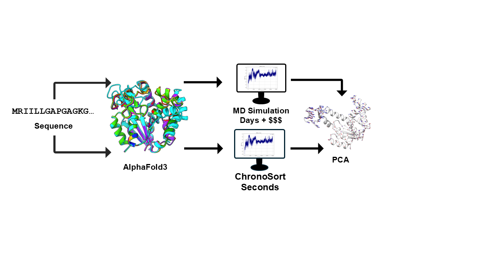

# ChronoSort

## Overview


ChronoSort is a computational framework designed to extract dynamic conformational information from protein ensembles generated by AlphaFold3. Using a novel algorithm, ChronoSort analyzes structural variations within these ensembles and correlates them with molecular dynamics (MD) simulations. This approach enables researchers to identify and characterize functionally relevant conformational states, bridging the gap between static structure predictions and dynamic behavior observed in MD trajectories. ChronoSort facilitates deeper insights into protein flexibility, mechanisms, and potential functional transitions by integrating predictive models with simulation data.

## Features

- **Dynamic Ensemble Analysis:** Extracts and compares structural variations from AlphaFold3-generated protein ensembles.
- **Automated Pipeline:** Includes scripts for streamlined analysis and reproducibility.
- **Customizable Workflows:** Easily adapt ChronoSort to new proteins or datasets.
- **Outputs:** Generates figures and data useful for interpreting outputs.
- **Colab Workflow:** Optional hosted notebook for users who prefer an interactive environment.

## Getting Started

ChronoSort ships with both command-line utilities and a Google Colab notebook. Example datasets are provided in `/data`.

### Installation

```bash
git clone https://github.com/dellacortelab/chronosort.git
cd chronosort
pip install -r requirements.txt
```

### Requirements

- Python 3.8+
- [MDAnalysis](https://www.mdanalysis.org/)
- [Biopython](https://biopython.org/)
- NumPy
- Matplotlib

## Command-Line Usage

An example CIF ensemble is found in `data/test_data`. To generate the example outputs:

```bash
python scripts/run_analysis.py --cif_dir data/test_data
```

This command reads all `.cif` files in the directory, constructs an RMSD-ordered trajectory, aligns backbone atoms, and performs PCA. Outputs are written to `output/` by default:

- `output/trajectory.pdb`
- `output/projection.pdb`
- `output/vecs.txt`
- `output/eigenvalues.png`

### Input File Requirements

The program expects a minimum of 100 CIF files (`.cif`) as input. The `.cif` format is the native structural output of the AlphaFold3 server, and each file should represent a structure generated from the same sequence but with a different random seed to capture structural diversity. Generated CIF files should be placed in the directory supplied to `--cif_dir`; for example:

```
data/test_data/
├── seed-1105522880_sample-0.cif
├── seed-1105522880_sample-1.cif
├── ...
```

ChronoSort automatically reads every `.cif` file in the provided directory.

### Custom Arguments

Tune the analysis with optional flags:

```bash
python scripts/run_analysis.py \
  --cif_dir path/to/cifs \
  --trajectory_file custom_outputs/trajectory.pdb \
  --vecs_file custom_outputs/vecs.txt \
  --projection_file custom_outputs/projection.pdb \
  --scale 25 \
  --components 0 1 2
```

`--components` accepts 0-based indices of the PCA modes to combine when generating the projected trajectory (e.g., `--components 0 1`).

### What Happens Under the Hood

- `trajectory.py` builds an ordered, superimposed multi-model PDB using RMSD minimization.
- `pca_analysis.py` aligns backbone atoms, performs PCA, and writes eigenvectors plus the projected trajectory.
- `run_analysis.py` ties the workflow together, ensuring output directories exist and feeding parameters between steps.

## Google Colab Workflow

Launch the hosted notebook to clone the repository, upload CIF ensembles (individual files or archives), run the pipeline, and download results directly from the browser:

[](https://colab.research.google.com/github/dellacortelab/chronosort/blob/main/chronosort_colab.ipynb)

The notebook automates repository cloning, dependency installation, upload processing, pipeline execution, and results packaging into a downloadable archive.

## Support

For questions, bug reports, or feature requests, please open an issue on GitHub. MD files referenced in the associated publication are available upon request from the authors.

---

## 📁 Project Layout

The repository is structured into six main folders (with the Colab notebook stored at the repository root):

| Folder             | Description                                                                 |
|--------------------|-----------------------------------------------------------------------------|
| `scripts/`         | Python modules (`trajectory.py`, `pca_analysis.py`, `run_analysis.py`). |
| `data/`            | Output files from running ChronoSort plus the bundled `test_data/` CIF ensemble. |
| `output/`          | Example outputs generated from the bundled dataset. |
| `results/`         | Figures from "ChronoSort: Revealing Hidden Dynamics in AlphaFold3 Structure Prediction." |
| `miscellaneous/`   | Files primarily for MD parameterization. Code not part of the main pipeline. |
| `source/`          | Example protein ensembles (CIF and PDB) for 5IBO, 1EX9, 4AKE, and 1ONC. |


